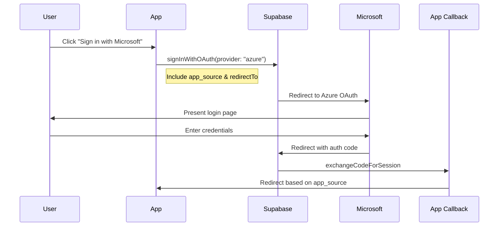
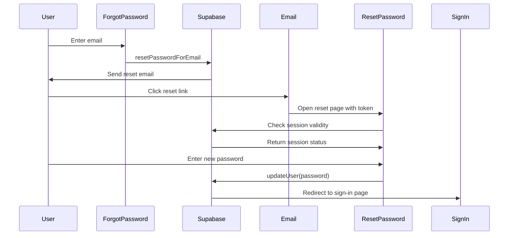

# Authentication Enhancements for Rathburn Web and Mobile Apps

## Overview

This document details the authentication improvements implemented across both the Rathburn web and mobile applications. These enhancements streamline the authentication flow, remove deprecated functionality, and ensure a consistent user experience.

## Web App Authentication Enhancements

### Authentication Pages Structure

| Page            | Path                                | Purpose                                                    |
| --------------- | ----------------------------------- | ---------------------------------------------------------- |
| Sign In         | `/app/(auth-pages)/sign-in`         | Primary login page with email/password and Microsoft OAuth |
| Forgot Password | `/app/(auth-pages)/forgot-password` | Request a password reset link                              |
| Reset Password  | `/app/(auth-pages)/reset-password`  | Set a new password after receiving reset link              |
| Magic Link      | `/app/(auth-pages)/magic-link`      | Request a passwordless login email                         |

### Key Improvements

1. **Magic Link Authentication**

   - Added a new magic link page for passwordless login
   - Implemented `sendMagicLinkAction` server action to handle magic link requests
   - Improved user messaging during the magic link process

2. **Password Reset Flow**

   - Enhanced the reset password page with session validation
   - Added loading and error states for better UX
   - Improved form validation and error handling

3. **OAuth Redirects**

   - Fixed Microsoft OAuth redirect URLs to properly handle callbacks
   - Added `app_source` parameter to track the origin app (web or mobile)
   - Ensured consistent hostname handling in production and development

4. **Server Actions**
   - Enhanced error logging and diagnostics in auth-related server actions
   - Improved success and error messaging to users
   - Added session validation for sensitive operations

## Mobile App Authentication Enhancements

### Key Improvements

1. **Simplified Authentication UI**

   - Removed all passcode-related UI and functionality
   - Streamlined the login interface to focus on Microsoft OAuth and email/password
   - Improved error handling and loading states

2. **Auth Hook Refactoring**

   - Consolidated authentication logic in a single `useAuth` hook
   - Removed deprecated passcode authentication methods
   - Improved type safety and error handling

3. **OAuth Improvements**

   - Added robust environment detection for proper redirect URL configuration
   - Enhanced debugging capabilities with detailed logging
   - Fixed hostname detection for correct app identification

4. **Authentication Flow**
   - Standardized authentication flow between web and mobile
   - Improved error messaging and user feedback
   - Added consistent logging for troubleshooting

## Technical Implementations

### OAuth Flow

### Password Reset Flow

## Code Changes Summary

### Web App

1. **Added Authentication Pages**

   - Created `/app/(auth-pages)/magic-link/page.tsx` for passwordless login
   - Enhanced `/app/(auth-pages)/reset-password/page.tsx` with session validation

2. **Server Actions**

   - Added `sendMagicLinkAction` for magic link authentication
   - Enhanced `resetPasswordAction` with better error handling
   - Updated `signInWithMicrosoftAction` with proper redirect URLs

3. **Auth Callbacks**
   - Improved `/app/auth/callback/route.ts` to handle app source identification
   - Added comprehensive logging for debugging authentication issues

### Mobile App

1. **UI Simplification**

   - Removed passcode-related UI from `Auth.tsx`
   - Simplified to email/password and Microsoft OAuth options

2. **Auth Hooks**

   - Consolidated authentication logic in `use-auth.ts`
   - Removed passcode-related code from `client-auth.ts`
   - Improved OAuth redirect handling based on app environment

3. **Debugging**
   - Added detailed logging throughout the authentication flow
   - Improved error messages for auth failures

## Cross-app Improvements

1. **Consistent Error Handling**

   - Standardized error messages across both apps
   - Added detailed logging to assist with troubleshooting

2. **Shared Authentication Flow**

   - Ensured both apps follow the same authentication patterns
   - Simplified code through removal of deprecated features

3. **Redirect Handling**
   - Fixed redirect URLs to correctly navigate between apps
   - Added cache-busting timestamp parameters to prevent issues

## Future Considerations

1. **Layout Issues**

   - Potential layout persistence issues may need investigation
   - The `isAuthPage` function might need refinement for edge cases

2. **Session Management**

   - Consider enhancing session timeout handling
   - Improve refresh token management

3. **Provider Expansion**
   - Consider adding more OAuth providers (Google, GitHub, etc.)
   - Implement social login options for broader access
