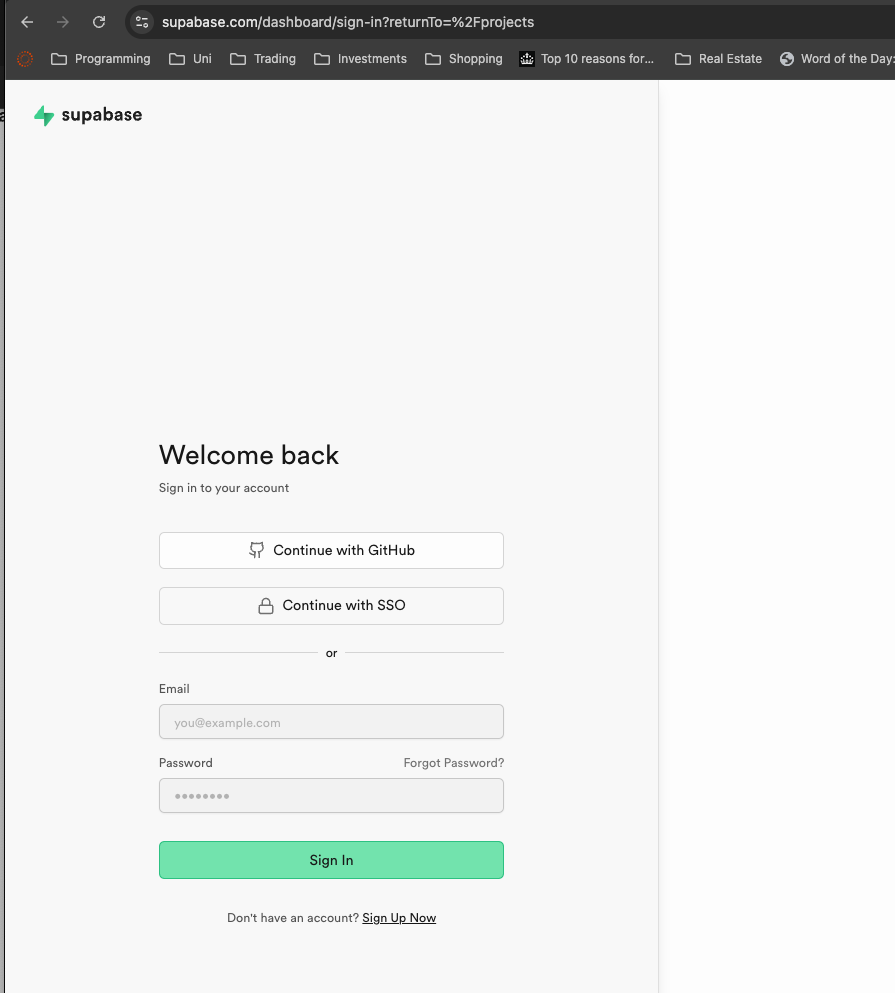

# Mobile App Passcode System: User Guide

## What is the Passcode System?

The Rathburn Chemicals mobile app uses a secure passcode system to keep the app and your data safe. Instead of remembering complex passwords, you can use a simple 4-digit passcode to quickly access the inventory management system on the go.

## How It Works

### Setting Up Your Passcode

If you already have a Rathburn account for the main web application, you can use the "Create Mobile Passcode" option on the login screen.

You'll need:

- Your preferred username for the mobile app
- Your Supabase User ID (see steps below)
- A 4-digit passcode that you can easily remember

## Finding your Supabase User ID

1. Login to the main Rathburn web app: [Rathburn App](https://rathburn.app). Click "Sign in With Microsoft", and login with your company account (e.g. `oslab@rathburn.co.uk`). Contact your manager, or me if you have any issues ([design@rathburn.co.uk](mailto:design@rathburn.co.uk))

2. Once signed in, you will see the page below. Click on your the third button in the top centre, with the icon of a database. This will open a new tab with the database connection page.

3. You will now see the page below. Log in with your the same email and password as your Rathburn account (e.g. `oslab@rathburn.co.uk`). This time, you will need to fill in your password manually.

_Note: If this is the first time you have logged in, you will need to be provided with a database account - contact your manager or me if you have any issues ([design@rathburn.co.uk](mailto:design@rathburn.co.uk))._

4. After logging in, click on the "Inventory Management" project. Note that new users may only see one project - if that's the case, simply click on the project that's available to you.

5. In the left sidebar, click on "Authentication" (if you don't have access to this section, please contact your manager or email [design@rathburn.co.uk](mailto:design@rathburn.co.uk)). You'll see a table of users. Find your email address in the list and click on it. This will open a detailed information panel where you'll see your Supabase ID at the top (a long coded number). Click on this ID to copy it, and use it to reset your passcode in the mobile app.

### Logging In

Login to the mobile app using the barcode scanner, at the website link [Mobile Scanner App](https://mobile.rathburn.app)

1. Enter your username
2. Enter your 4-digit passcode
3. Tap "Sign In"

## Security Features

### Your Passcode is Secure

Your passcode is never stored as plain text. When you create or change your passcode, our system:

- Applies industry-standard encryption
- Stores only the encrypted version (called a "hash")
- Adds a unique security element (called a "salt") to ensure that even identical passcodes appear different in the system

This means:

- No one, not even system administrators, can see your actual passcode
- If someone ever gained unauthorized access to the database, they still couldn't determine your passcode
- Your passcode remains secure even if a device is lost or stolen

### Keep Your Passcode Safe

For security reasons:

- Store your passcode in a safe place, such as your personal mobile phone
- **Never share your passcode with anyone else**
- If you suspect someone knows your passcode, change it immediately

### Account Protection

For your security, the system includes additional protections:

- After 5 failed login attempts, your account will be temporarily locked for 5 minutes
- The lockout period helps prevent unauthorized attempts to guess your passcode
- You'll see how many attempts remain before a lockout occurs

## Always Log Out When Finished

**It is critical that you log out of the app when you are finished using it.**

- The app will automatically log you out after a period of inactivity (adjustable in app settings)
- However, for maximum security, you should **always manually log out** when you're done
- The log out button is prominently displayed in the app interface

<!-- I will add an image here showing the interface with an arrow to the log out button. -->

## Resetting Your Passcode

If you forget your passcode:

1. Tap "Forgot passcode?" on the login screen
2. Enter your username
3. A secure reset link will be sent to the email address associated with your account
4. Follow the link to create a new 4-digit passcode

The reset link:

- Can only be used once
- Expires after one hour
- Provides a secure way to regain access to your account

## Connection to Your Main Account

The mobile passcode system is securely connected to your main Rathburn account:

- Your mobile login credentials are linked to your primary user account
- This means actions you take on the mobile app are properly attributed to you
- The system maintains consistent access controls across both the web and mobile platforms

## Need Help?

If you have any issues with your passcode:

- Contact your supervisor for immediate assistance
- Email conrad@rathburn.app for technical help
- Call the company at 01896 870651

**Good Luck!**

