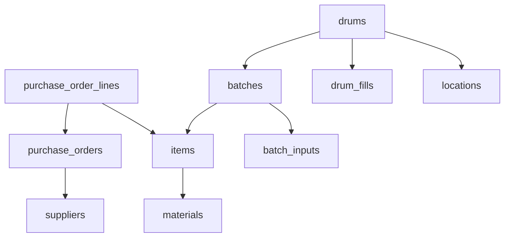
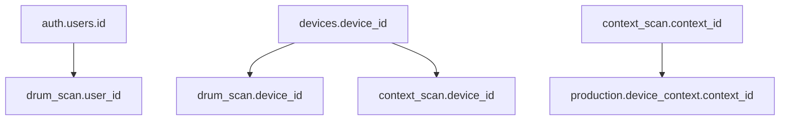
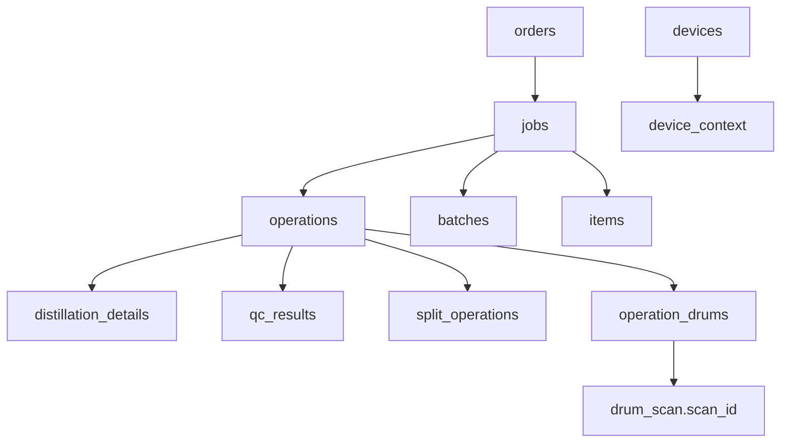

# Scanning Workflow & Production Dashboard Overview

## 1. Inventory Management

### 1.1 Business Context

### Suppliers & Purchase Orders

- Onboard materials via **purchase orders** (POs) from **suppliers**.
- Each PO may contain multiple **lines**, each specifying an **item** and quantity.

### Materials & Items

- **Materials** (e.g. “Acetone”) represent chemical types, identified by CAS number and group.
- **Items** are specific purchasable forms of a material (e.g. 200 L Methanol drum for £385.00 from Kimia), uniquely defined by material, supplier, packaging, and cost metadata.

### Receipt & Batching

- Upon arrival, each delivery spawns a **batch** (type: new, repro, etc.) tied to an item and - if type is "new" - optionally back‑linked to its PO.
- Batch data is updated with its batch code upon receipt using the application UI.
- Batches record a total volume; incremental additions (topping up, combining) use **batch_inputs** events.

### Drum Lifecycle

- Physical **drums** are created per batch, carrying a **serial_number**, **current_volume**, **status** (in‑stock, in‑use, empty), and **location**.
- **drum_fills** track each fill event (volume_added, timestamp).
- **batch_inputs** track non‑drum‑specific volume events (e.g. bulk transfers).

### Locations

- `locations` is a hierarchical table (warehouse → aisle → rack → shelf) to which drums (and optionally batches) are assigned.

### 1.2 Core Tables & Relationships

---

## 2. Scanning & Audit Logs

### 2.1 Overview

- All barcode and QR scans by operators (drum labels or context codes) are logged in **drum_scan** and **context_scan**.
- Each scan captures: user, device, raw code, interpreted entity, timestamp, status/error, and optional metadata.
- **devices** stores scanner inventory (hw_id, model, OS version, last_seen).

### 2.2 Key Relationships

---

## 3. Production Workflow & Monitoring

### 3.1 Business Process

1. **Orders & Jobs**

   - Internal/customer **orders** schedule production: define item, quantity (# of drums), date, and priority.
   - Orders spawn one or more **jobs** linked to an **input_batch** and scheduled start/end.

2. **Operations**

   - Each job breaks into discrete **operations** (e.g. mix, heat, distill, filter).
   - Operations track planned vs. actual times and status flags.

3. **Resource Allocation**

   - **operation_drums** ties scanned drums (with volumes transferred) to operations.
   - **drum_usage** records longer‑term drum assignments to operations.

4. **Quality & Splits**

   - **distillation_details** (raw_volume, expected_yield, JSON) and **qc_results** (grade, tested_at, volume, metadata).
   - **split_operations** capture parent→child splits for parallel processes or re‑batches.

5. **Context Binding**
   - Operators scan a station QR to bind a device to a context via **device_context**, ensuring subsequent drum scans map to the correct job/operation.

### 3.2 Core Relationships

---

## 4. End‑to‑End Flow Summary

1. **Procurement**: Create PO → receive goods → batch → drum_fill → store.
2. **Inventory**: Real‑time tracking via `drum_scan`, `batch_inputs`, `drum_fills`, and `context_scan`.
3. **Production Kickoff**: Order → Job → schedule.
4. **Execution**: Station context scan → drum(scan) → `operation_drums` record → update `drums.current_volume` & status.
5. **Quality**: Distillation and QC events captured.
6. **Fulfillment**: Job completes → dispatch scans → final status updates.

---

## 5. UI & Workflow Patterns (Next.js + Tailwind)

- **Task Dashboard**: Cards for active orders, showing item, quantity, schedule, status, and progress bar.
- **Context‑Scan Wizard**: Stepwise UI (“Scan Station → Scan Drum(s) → Confirm”) backed by `/api/operations/:opId/context-scan`.
- **Drum Detail Timeline**: Vertical timeline of inventory, scan, operation, and QC events.
- **Bulk Actions**: Drag‑drop or multi‑select for assigning multiple drums.
- **Enforced Scans**: Each state transition in the UI gated by the corresponding scan log.

---

## 6. Adoption & Compliance Recommendations

1. **Simplicity**: Two‑tap flows (“Scan location → Scan drum”).
2. **Feedback**: Visual (toasts), auditory (beep), and haptic (vibration) confirmation.
3. **Offline Resilience**: Local caching with automatic sync.
4. **Hands‑on Training**: Live demos on the shop floor.
5. **Real‑time Dashboards**: Display team compliance metrics publicly.
6. **Exception Handling**: Manager‑approved overrides, fully audited.
7. **Supervisor Alerts**: Non‑compliance reporting to management.

---

## 7. Gamification & Engagement

To drive consistent SOP adherence, boost morale, and deter negligence, we propose a gamified layer:

- **Prestige Levels & XP**: Award experience points for each valid scan (context + drum). Levels unlock badges, cosmetic themes, or simple perks.
- **Leaderboards**: Weekly and all‑time rankings by points, scans per shift, or fastest context‑drum cycles—balanced to reward both tenure and daily performance.
- **Ranked/ELO System**: A 5‑star rating adjusts up/down based on scan accuracy, speed, and SOP compliance (e.g. missed or late scans penalize rating).
- **Achievements & Milestones**:
  - **License to Scan**: Milestone series (1/1, 1/5, 5/25, …100/5 000 scans).
  - **Scantastic**: Complete one of each code‑type scan (new, repro, station QR).
  - **Chemiconnoisseur**: Scan X distinct chemical types.
  - **Quick on the Draw**: Perform a valid context+drum scan within 10 s (then milestones at 5 s, 3 s).
  - **Auditor**: Use the “Report Issue” feature to flag a problem.
- **Recognition & Rewards**: Digital badges in profile, weekly email shout‑outs, and a physical “Top Scanner” board in the lab.

**Business Rationale**: Gamification leverages intrinsic motivation and social competition to ensure high compliance. By making SOPs into achievements, workers organically adopt the desired behavior; management gains visibility into activity patterns and can reward true performers, reducing risk of negligent or malicious device use.

---

_This document combines high‑level process flows, key data relationships, UI patterns, and behavioural design to present a comprehensive overview for business stakeholders._
