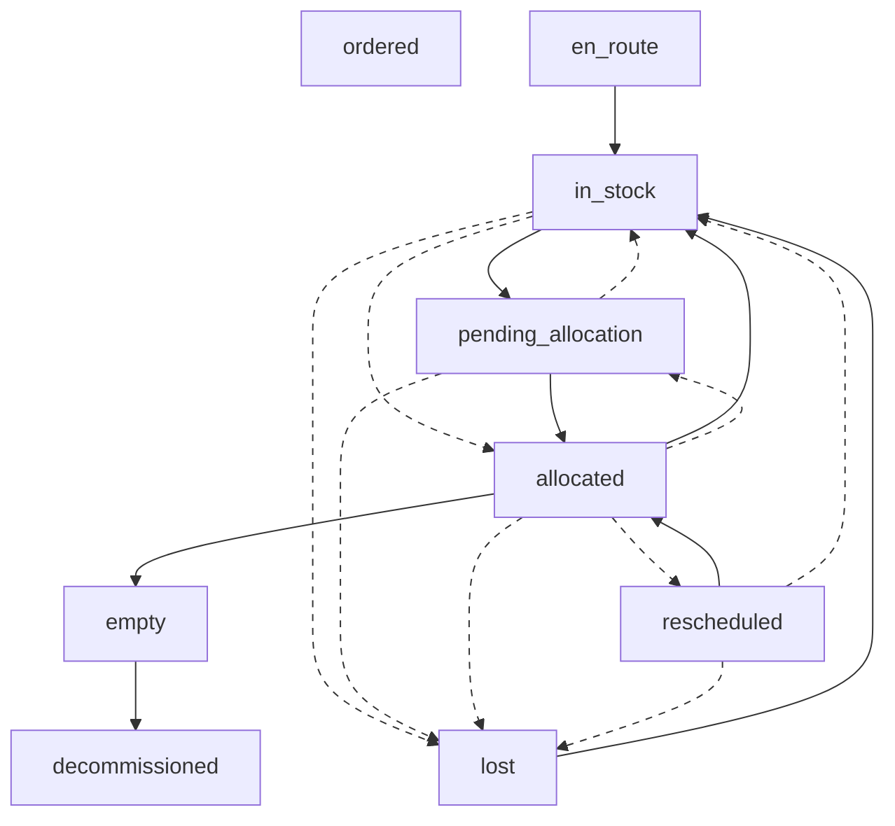

# inventory.stock_drum

> Documentation of Table Design and Backend Logic

## Table Fields

1. **`status`**

- **en_route** – Drum is in transit to our facility.
- **in_stock** – Drum has been received and is available in inventory.
- **pending_allocation** – Drum has been removed from stock for a scheduled production but isn’t yet scanned at the still.
- **allocated** – Drum has been assigned to a production run (awaiting still load).
- **rescheduled** – Drum’s allocation has been deferred or re‐scheduled (e.g. for multi‐process operations).
- **empty** – Drum has been fully consumed (loaded completely into the still).
- **decommissioned** – Drum is disposed of after use.
- **lost** – Drum is missing or unaccounted for.

### Logic

```sql
INSERT INTO inventory.drum_status_transitions VALUES
  -- Drum arrival and reception
  ('en_route', 'in_stock', false, false),

  -- From in_stock, when a drum is earmarked for production
  ('in_stock', 'pending_allocation', false, false),
  ('in_stock', 'allocated', true, false),  -- direct allocation (admin override)

  -- Pending allocation can either be confirmed or cancelled
  ('pending_allocation', 'allocated', false, false), -- confirmed via first QR code scan
  ('pending_allocation', 'in_stock', true, true),      -- cancellation of production

  -- Once allocated, a drum may either be:
  ('allocated', 'empty', false, false),             -- fully consumed (complete load)
  ('allocated', 'in_stock', false, false),            -- partially used, returned to stock
  ('allocated', 'pending_allocation', true, true),    -- reversal (erroneous allocation)
  ('allocated', 'rescheduled', false, false),           -- deferred for a subsequent process

  -- Rescheduled drums can be reallocated or returned to stock
  -- Doesn't need a pending step, as drum and still already matched at the first process
  ('rescheduled', 'allocated', false, false), -- same logic as pending to allocated
  ('rescheduled', 'in_stock', true, true), -- cancel second process || use partial drum

  -- Once a drum is empty, it is decommissioned
  ('empty', 'decommissioned', false, false),

  -- Lost drum transitions from various statuses (manual intervention required)
  ('in_stock', 'lost', true, false), -- lost drums cannot be scanned as lost for obvious reasons
  ('pending_allocation', 'lost', true, false),
  ('allocated', 'lost', true, false),
  ('rescheduled', 'lost', true, false)
  -- Optionally, if a lost drum is found, you might allow:
  ('lost', 'in_stock', false, false) -- any lost drum scanned updates it to in-stock, no admin needed
;
```

### Status Notifications

- ANY -> 'in_stock' (updates on new drums entering inventory)
- 'allocated' -> ['empty', 'in_stock'] (distillation in progres; drum removed from stock count)
- ANY -> 'lost' (message_type 'important')

### Status Progression Flow Chart

