# Database Schema Diagram

```mermaid
erDiagram
    %% Reference Tables
    ref_materials {
        string code PK
        string value
        string chemical_group FK
    }
    ref_suppliers {
        int supplier_id PK
        string supplier_name
    }
    ref_stills {
        int still_id PK
        string still_code
        int lab_id FK
        boolean is_operational
    }
    ref_labs {
        int lab_id PK
        string lab_name
        string lab_site
    }

    %% Relationships - Inventory Flow
    ref_suppliers ||--o{ stock_order : supplies
    stock_order ||--o{ order_detail : contains
    ref_materials ||--o{ order_detail : specifies
    order_detail ||--o{ stock_drum : creates

    %% Relationships - Scanning Flow
    stock_drum ||--o{ log_drum_scan : scanned_as
    log_drum_scan ||--o{ log_transport_drum : triggers_transport
    log_transport_drum ||--o{ distillation_pending_assignment : creates_assignment

    %% Relationships - Distillation Flow
    ref_stills ||--o{ distillation_schedule : used_in
    ref_labs ||--o{ ref_stills : houses
    distillation_schedule ||--o{ distillation_record : records
    distillation_schedule ||--o{ log_load_still : loads
    distillation_schedule ||--o{ log_start_distillation : starts
    log_drum_scan ||--o{ log_load_still : used_in

    %% Cross-flow Relationships
    stock_drum ||--o{ log_transport_drum : moved_via
    stock_drum ||--o{ log_load_still : loaded_via
    distillation_schedule ||--o{ distillation_pending_assignment : assigned_to
    stock_activity ||--o{ order_detail : tracks
```

Key changes I made:

1. Removed spaces and quotes from relationship labels
2. Used underscores instead of spaces in relationship labels
3. Simplified the diagram to focus on relationships first (we can add back the table details once we confirm this works)

If this still doesn't work, you might need to:

1. Install the "Markdown Preview Mermaid Support" extension in VSCode
2. Or use an online Mermaid editor like https://mermaid.live/

Would you like me to provide the complete diagram with all table details once we confirm this simplified version works?
